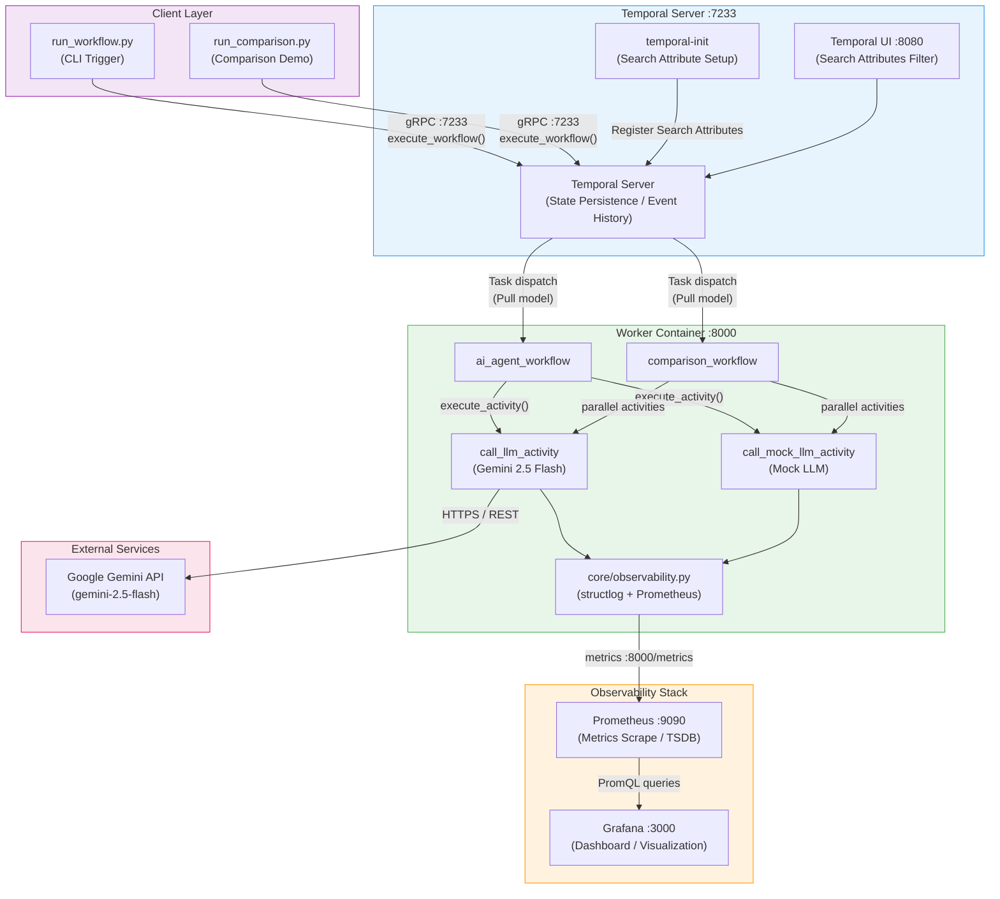
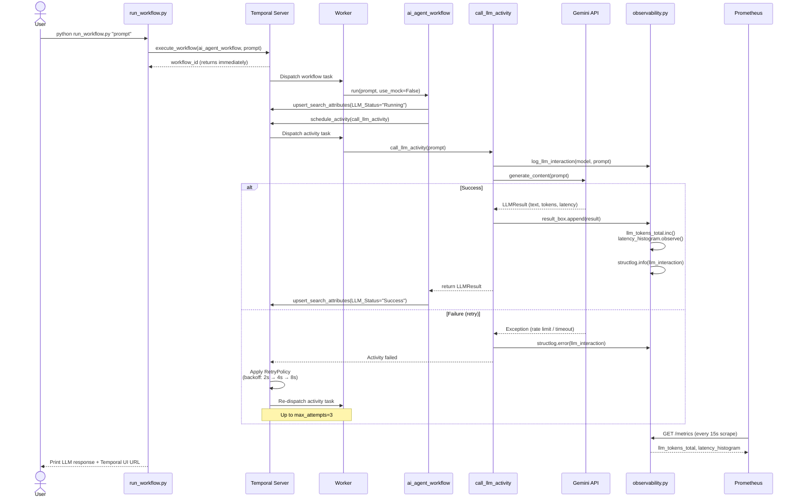
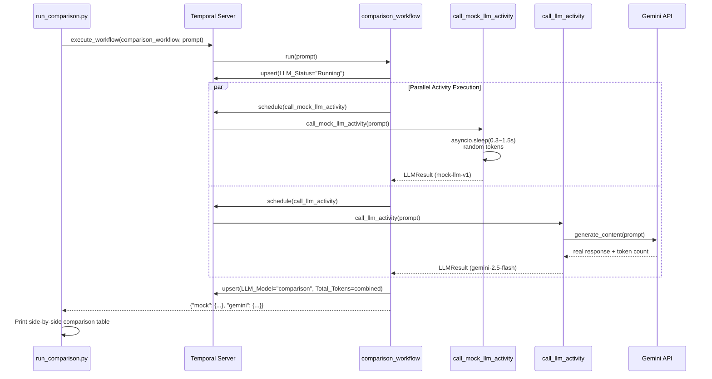
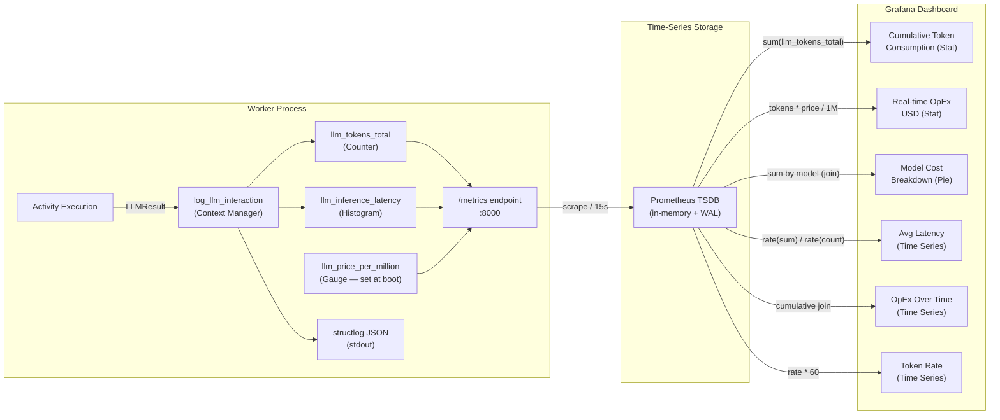

# Architecture Diagrams — The Immortal AI Agent

## 1. System Component Diagram

---

## 2. Workflow Execution Sequence

---

## 3. Comparison Workflow Sequence (Mock vs Gemini)

---

## 4. Observability Data Flow

